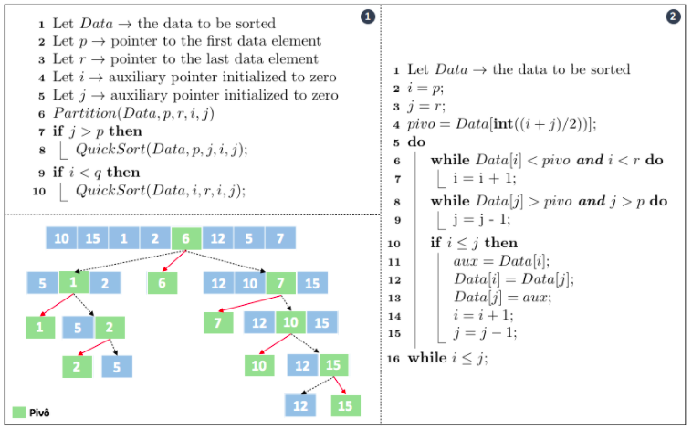

# Quick Sort: Implementação em C

 
 
 
 

 

 

Desenvolvido na Universidade de Moscou / Rússia por Sir Charles Antony Richard Hoare em 1960 e apresentado para a comunidade acadêmica em 1962 por meio de publicações, o Quick Sort é um dos algoritmos de ordenação interna (i.e., executado totalmente em memória RAM) mais rápido que se conhece. O método se baseia no mesmo princípio do Merge Sort, na divisão e conquista. Contudo, segundo literatura, sua forma de execução melhor se define como conquista e divisão, uma vez que ordenações são realizadas antes das divisões propriamente ditas. Esse algoritmo foi criado quando Sir Charles Antony Richard Hoare tentava traduzir um dicionário do inglês para o russo e para isso ele se dedicou a tentar dividir o problema em problemas menores que podiam ser resolvidos com maior agilidade. Para isso, o conceito de pivô foi apresentado.

Um pivô nada mais é que um elemento do conjunto, selecionado muitas vezes "<i>arbitrariamente</i>", que serve como base comparativa para com os demais valores existentes. Nesse contexto, as movimentações no vetor são realizadas sempre que detectado que o valor observado é maior ou menor que o valor estabelecido pelo pivô. Assim, valors maiores são direcionados para a direita do pivô, enquanto, os menores são movimentados para esquerda do mesmo.

> No Quick Sort, o processo de ordenação segue os seguintes passos:
>
> 1. Escolha "<i>arbitrariamente</i>" um elemento do conjunto para ser o pivô. 
>
> 2. Reorganize o conjunto de elementos para garantir que os elementos da esquerda são menores que o pivô e os da direita maiores. Nessa etapa é conquistado a posição final do pivô e duas sub listas parcialmente reorganizadas.
>
> 3. Recursivamente, repita os passos 1 e 2 para cada sub lista obtida até que não haja mais elementos a serem ordenados.

Tal como no Merge Sort, o método de ordenação por Quick Sort utiliza duas partes para representar o processo de divisão e conquista. O pseudo algoritmo a seguir detalha esses métodos e ações realizadas por cada um a partir de um pequeno exemplo.

	 

 

Note pela figura acima representada que a parte ( 1 ) do algoritmo inicia chamando partição na linha 6, o que gera em nosso exemplo a escolha do elemento 6 como pivô. Nesse passo, todos os elementos menores que 6 são mantidos à esquerda e os maiores à direita, conforme segunda linha do exemplo. O ponto principal a se observar é que não há ordenação dos subconjuntos, apenas movimentação para manter a regra do pivô. Feito isso, cada subconjunto produzido passa pela mesma ação de escolher um pivô e depois executar a separação. O algoritmo finaliza quando há apenas dois elementos como subconjunto, o que já garante uma ordenação simples apenas trocando ambos de posição, se necessário. 

Quanto aos custos envolvidos, o pior caso do Quick Sort ocorre quando, sistematicamente, o pivô é escolhido como sendo um dos extremos do conjunto, ou seja, o menor ou o maior entre todos os elementos. Nesse caso, a quantidade de movimentações no vetor aumenta significativamente e pode deixar o método lento. Isso porque em termos de custo ele apresenta O(n2), o que o torna parte do grupo de algoritmos de custo quadratico.

O pior caso associado ao Quick Sort pode ser evitado escolhendo-se não um mas três elementos do conjunto como pivô e em seguida selecionando desses o mais próximo da mediana. Essa solução é citada em literatura como sendo a solução da mediana de três, a qual se mostra para a maioria dos casos uma ação efetiva para garantir a performance do método. 

> Considerando suas diferentes formas de implementação para uma análise de custos, temos como vantagens de desvantagens do Quick Sort: 
>
>- <b>Vantagens</b>: (1) É extremamente eficiente no processo de ordenação; (2) sua utilização de memória é menor em comparação com o Merge Sort, o que o torna melhor opção para arquivos grandes e; (3) ele requer em média n<i>log</i>n comparações para ordenar um conjunto com <i>n</i> elementos.
>
> - <b>Desvantagens</b>: (1) Apresenta um pior caso que o aproxima dos custos de algoritmos de ordenação quadráticos, esse é observado quando há números repetidos no conjunto; (2) sua implementação é sensível a ordem das chamadas recursivas, o que induz facilmente a erros de implementação e; (3) o método é classificado como método não estável. 

# Compilação e Execução

O método Quick Sort disponibilizado possui um arquivo Makefile que realiza todo o procedimento de compilação e execução. Para tanto, temos as seguintes diretrizes de execução:

| Comando                |  Função                                                                                           |                     
| -----------------------| ------------------------------------------------------------------------------------------------- |
|  `make clean`          | Apaga a última compilação realizada contida na pasta build                                        |
|  `make`                | Executa a compilação do programa utilizando o gcc, e o resultado vai para a pasta build           |
|  `make run`            | Executa o programa da pasta build após a realização da compilação                                 |

# Contatos

<a style="color:black" href="mailto:michel@cefetmg.br?subject=[GitHub]%20Source%20Dynamic%20Lists">
✉️ <i>michel@cefetmg.br</i>
</a>